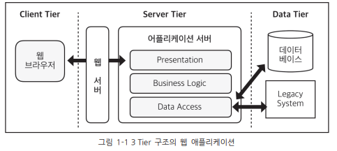
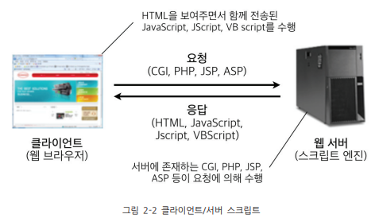
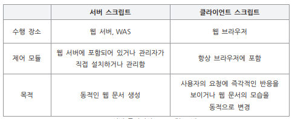

## 웹 애플리케이션(Web Application)
`웹 애플리케이션` : 웹 브라우저 상에서 HTTP프로토콜 및 HTML 문서를 바탕으로 수행되는 애플리케이션 

 

### 웹 애플리케이션 구조

- **Client Tier** 
웹 브라우저가 해당하는 층으로 사용자가 실제로 접하는 프로그램 
- **Server Tier** 
동적 웹 컨텐츠 기술(파이썬, JSP, CGI) 
Client Tier와 Data Tier을 연결해 주는 소프트웨어 또는 하드웨어 
애플리케이션 서버는 **Presentation, Business Logic, Data Access**로 나뉨
- **Data Tier**
하부단의 저장매체로 파일 서버나 데이터 베이스 서버 등 하드웨어 장비 
 

### 요청과 흐름
1. 웹 브라우저가 웹 서버에게 특정 페이지를 요청
2. 해당 웹 서버는 웹 브라우저의 요청을 받아서 요청된 페이지의 로직 및 DB와의 연동을 위해 웹 애플리케이션 서버에 처리 요청
3. 웹 애플리케이션 서버는 DB와 연동 필요하면 DB와의 데이터 처리 수행
4. 로직 및 DB 작업의 처리 결과 웹 서버에 리턴
5. 웹 서브는 결과를 다시 웹 브라우저에게 응답 
 

### 웹 애플리케이션 관련 기술

#### 1) Client Tier 기술
- HTML(Hyper Text Markup Language)
- HTML5
- JavaScript
- RIA(Rich Internet Application)
- Ajax(Asynchronous JavaScript and XML)
#### 2) Server Tier 기술
- ASP(Active Server Page)
- PHP(Professional Hypertext Preprocessor)
- JSP(Java Server Page)
- Servelet
- Node.js

